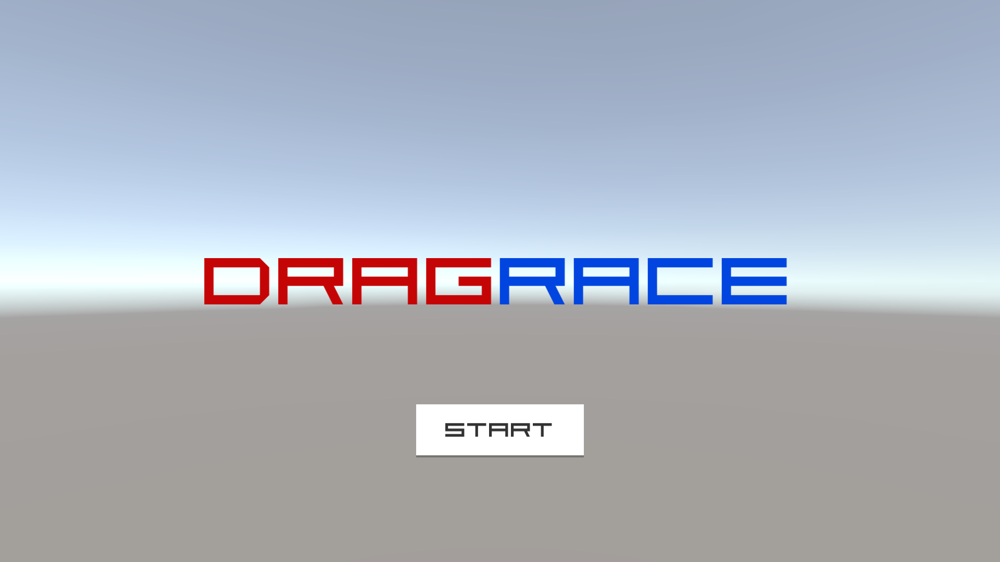
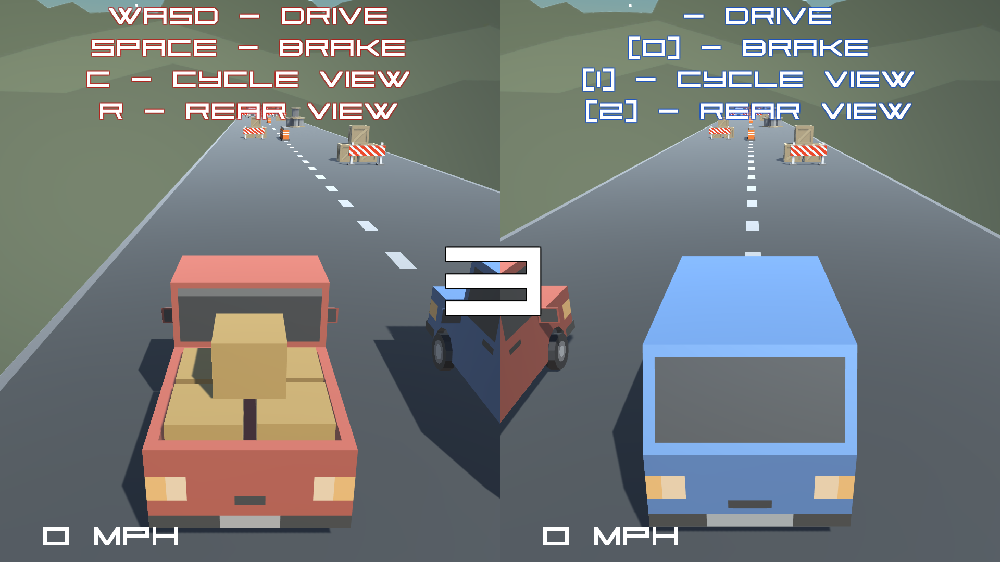
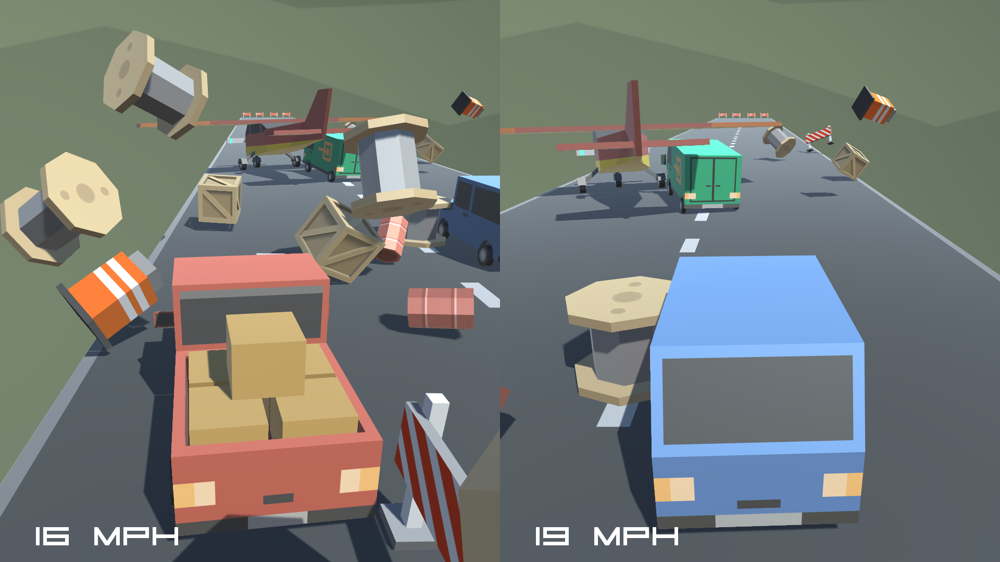
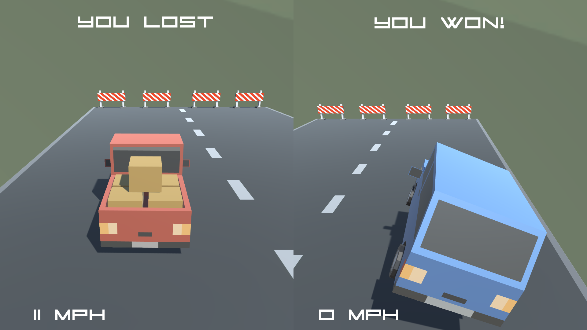
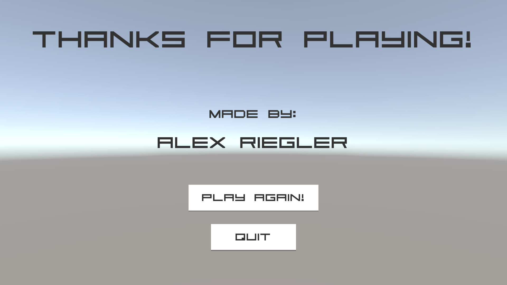

# Drag Race (Prototype 1)
> A split screen drag racing game where players must avoid obstacles and be the first to reach the finish line.

## Table of contents
* [General Info](#general-info)
* [Screenshots](#screenshots)
* [Technologies](#technologies)
* [Setup](#setup)
* [Features](#features)
* [To-do List](#to-do-list)
* [Status](#status)
* [Contact](#contact)

## General Info
The [first week of the course](https://learn.unity.com/tutorial/week-1-player-control-jul-13-jul-17?uv=2018.4&courseId=5ed163d8edbc2a0969cd1ded "Week 1 - Player Control: Jul 13 - Jul 17 | Unity Learn") focused on player control and gaining familiarity with the Unity editor. We were tasked with creating a prototype game from assets provided by Unity. The game at a minimum was supposed to include a player vehicle, a following camera, obstacles with collision, and player control. There were also "challenges" provided which included creating stacks of obstacles, adding moving car obstacles, adding the ability to switch camera views, and adding split screen for two players. I implemented all of these features in my game along with some additional features and modifications.

## Screenshots
Beginning of the game

Middle of the game

End of the game

Credits

## Technologies
* [Unity 2018.4.24f1](https://unity3d.com/unity/qa/lts-releases "LTS Releases - Unity")
* C# 4.0

## Setup
### How to play
You can go [here](https://connect.unity.com/mg/other/drag-race-prototype-1 "Drag Race (Prototype 1) - Unity Connect") to play the WebGL version of the game online from the Unity Connect website.

### How to work with this Unity project
To work with this project, you can follow the instructions on the [main README.md](../README.md#how-to-work-with-the-unity-projects).

## Features
* Cycle camera views
* Rear view
* Split screen, local multiplayer
* Menu
* Winning player celebration animations
* Speedometer UI display
* Respawning
* Countdown timer
* Credits

## To-do List
* Procedurally generated road & obstacles
* Sound & music
* Destructable boxes
* And many other possiblities...

## Status
Project is: _finished_

## Contact
Created by [Alex Riegler](https://www.linkedin.com/in/alexander-riegler/ "Alexander Riegler | LinkedIn") - feel free to contact me!
