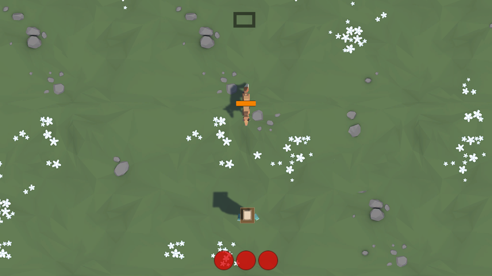
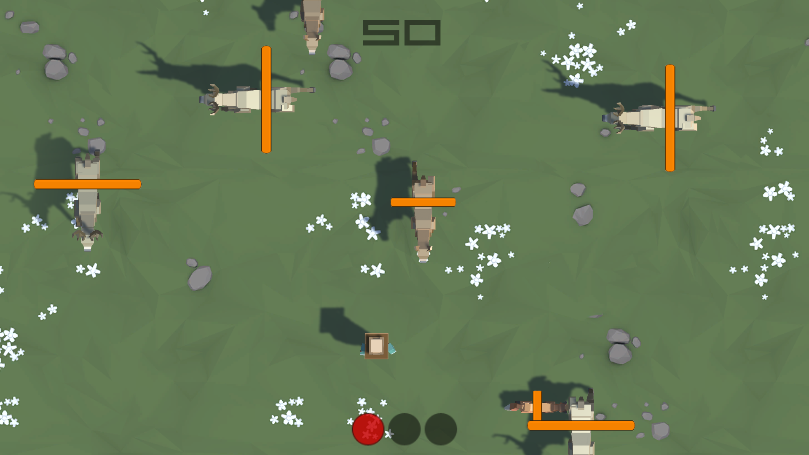

# If You Feed a Fox a Fruit (Prototype 2)
> A bullet hell feeding frenzy game where the player must feed and avoid incoming animals.

## Table of contents
* [General Info](#general-info)
* [Screenshots](#screenshots)
* [Technologies](#technologies)
* [Setup](#setup)
* [Features](#features)
* [To-do List](#to-do-list)
* [Status](#status)
* [Contact](#contact)

## General Info
The [second week of the course](https://learn.unity.com/tutorial/week-2-basic-gameplay-jul-20-jul-24?uv=2018.4&courseId=5ed163d8edbc2a0969cd1ded "Week 2 - Basic Gameplay: Jul 20 - Jul 24 | Unity Learn") focused on basic gameplay elements and game object management. We were once again tasked with creating a prototype game from assets provided by Unity. The game at a minimum was supposed to include a top down camera, a player that can move left/right, the ability to fire projectiles, destruction of objects out of bounds, random animal spawning, and collisions. There were also some challenges which included adding the ability to move forwards/backwards, animals spawning from the sides, log game over to the console on certain conditions, track score and lives, and display a hunger bar on animals. I implemented all of these features in my game along with some additional features and modifications.

## Screenshots
Here are some in-game screenshots of _Drag Race_. You can also download [this video](./Videos/gameplay.mp4) to watch some gameplay in action (unfortunately, the video is too large to preview).

Beginning of the game

Middle of the game

End of the game

Credits

## Technologies
* [Unity 2018.4.24f1](https://unity3d.com/unity/qa/lts-releases "LTS Releases - Unity")
* C# 4.0

## Setup
### How to play
You can go [here](https://connect.unity.com/mg/other/drag-race-prototype-1 "Drag Race (Prototype 1) - Unity Connect") to play the WebGL version of the game online from the Unity Connect website.

### How to work with this Unity project
To work with this project, you can follow the instructions on the [main README.md](../README.md#how-to-work-with-the-unity-projects).

## Features
* Cycle camera views
* Rear view
* Split screen, local multiplayer
* Menu
* Winning player celebration animations
* Speedometer UI display
* Respawning
* Countdown timer
* Credits

## To-do List
* Procedurally generated road & obstacles
* Sound & music
* Destructable boxes
* And many other possiblities...

## Status
Project is: _finished_

## Contact
Created by [Alex Riegler](https://www.linkedin.com/in/alexander-riegler/ "Alexander Riegler | LinkedIn") - feel free to contact me!
